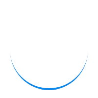

# Save The Drop

A website about conservating water and it's importance in our life.

## Technology Used :
* HTML
* CSS
* Bootstrap
* JavaScript
* Google Forms
* Paypal Payment Integration

Designed with HTML, CSS and Bootstrap. A donation button is included which is integrated with *[Paypal](https://www.paypal.com)* through which payment to a specific account can be done.This Website is Responsive for every screen resolution.

## Paypal Integration:
We need an account at [Paypal](https://paypal.com) where we can generate a link for payments and embed it in website with a custom button, where we can use any button.
###### Button Source:
        

###### Source code for Button and link together
        
     
## "Join Us" Form using [Google Forms](https://www.google.com/forms/about/)
All response using this form are stored in the [Google Forms](https://www.google.com/forms/about/) 

###### Attributes we need to customize the form
Basic syntax for *input* tag in join Us page:
        <input type="text" name="entry.648625325" placeholder="John" required>
        
   * "entry.648625325" is the name for the first name  and this value can be found at the [Original Google form](https://docs.google.com/forms/d/e/1FAIpQLSffhL61XBXROZO6YJKoOMKrJfDwyKUbYTLE1dP81j7DamqJGg/viewform)
   
         <input type="text" class="quantumWizTextinputPaperinputInput exportInput" jsname="YPqjbf" autocomplete="off" tabindex="0" aria-label="First Name" aria-describedby="i.desc.2057767176 i.err.2057767176" name="entry.648625325" value="" required="" dir="auto" data-initial-dir="auto" data-initial-value="" aria-invalid="true">
   
   * We need to inspect the source code and find the location of the particular input (For Example Name or any other value)

   * We have to insert the value of *"action"* in *"form"* Attribute as the link of the form.
        
         <form action="https://docs.google.com/forms/d/e/1FAIpQLSffhL61XBXROZO6YJKoOMKrJfDwyKUbYTLE1dP81j7DamqJGg/formResponse" method="POST" target="hidden_iframe" onsubmit="submitted=true;">
         
Thats all we need to customize the form and Integrate it with google form. There will be no *"Google Form"* watermark or name mentioned using this method.

## Redirecting To Home after Submission
        <meta http-equiv="refresh" content="1; url=https://savethedrop.netlify.com" />
Above *meta* tag will refresh the page to the new link which should be the link to the home.
Before Refreshing the page we can show a thanks message and loading animation.
        
        

                    <h1>Thanks for joining Us</h1>
                    <h3>You'll be redirect to home. If not please <a href="https://savethedrop.netlify.com">Click Here</a></h3>
                    
        

